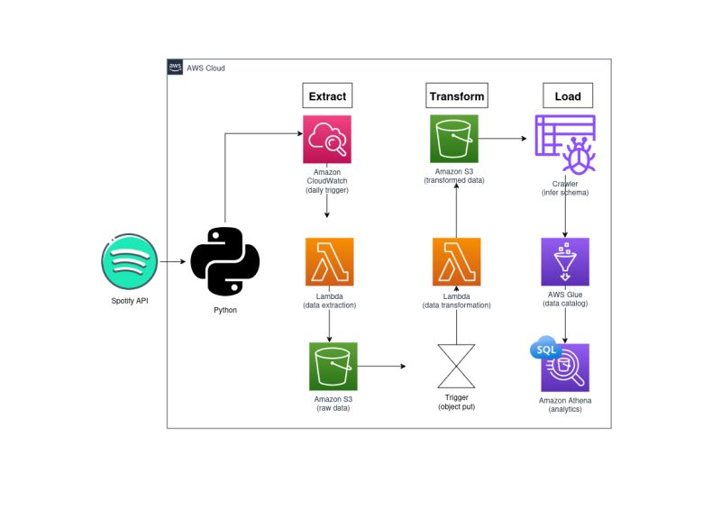
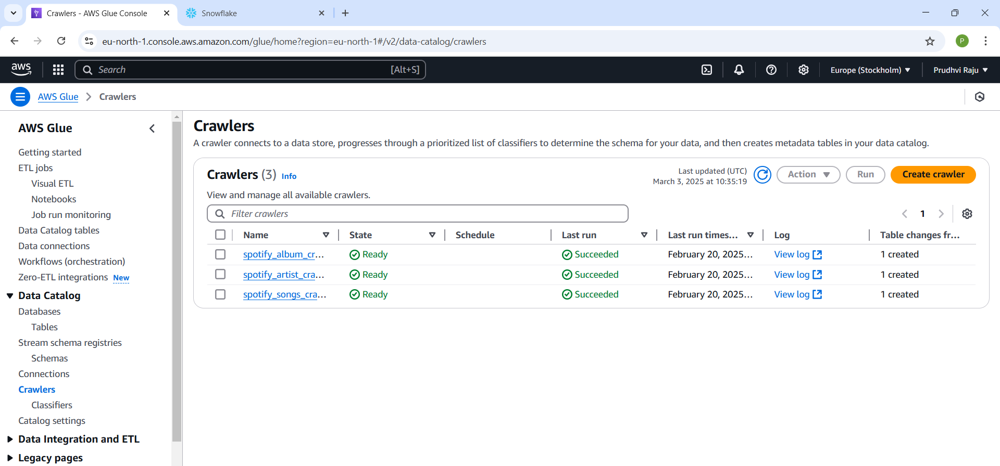
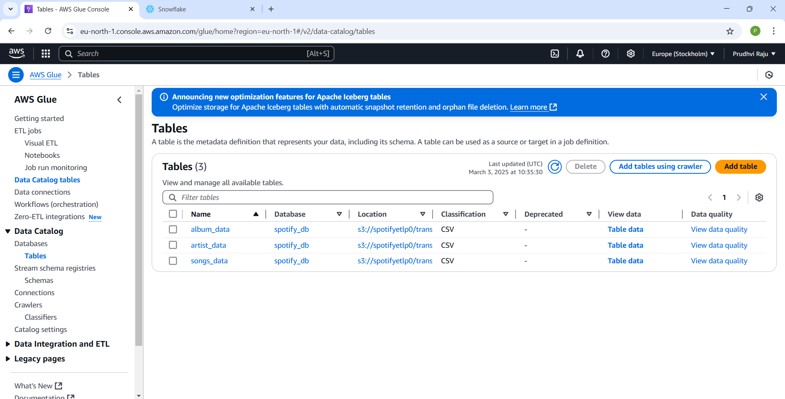
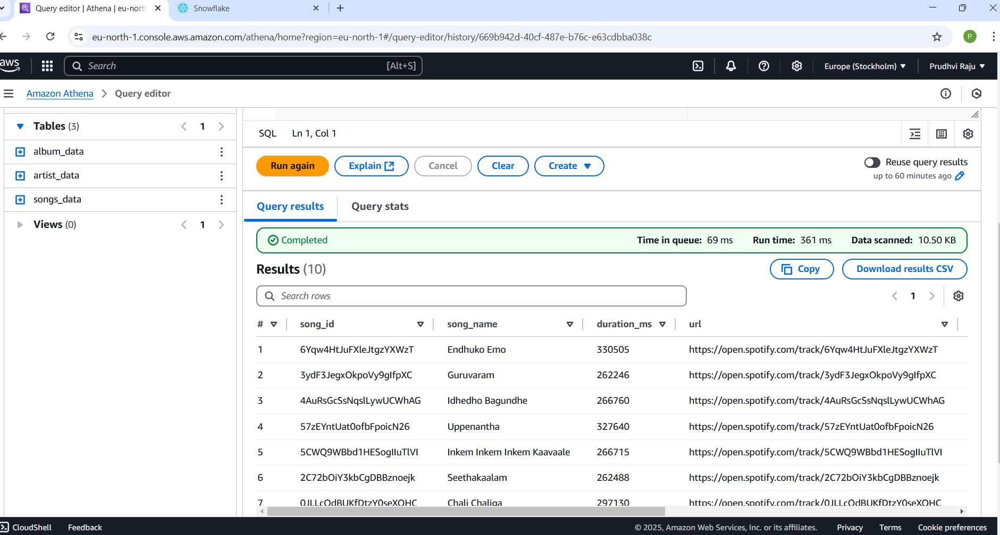
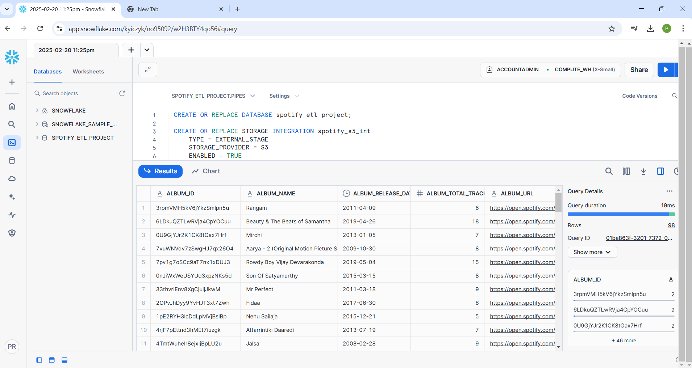
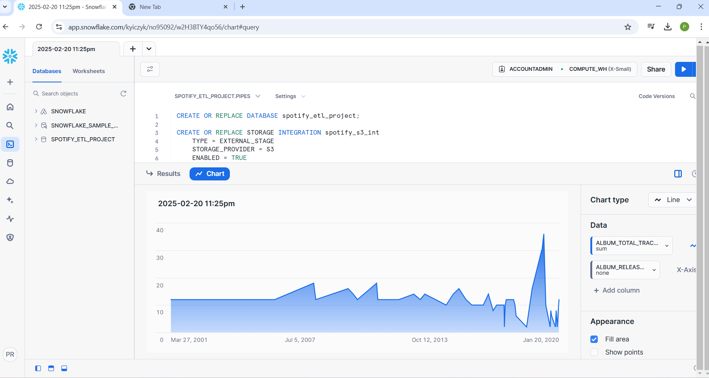

# Spotify Data Automation Pipeline: Scalable ETL and Real-Time Insights Project

This project demonstrates how to build an ETL pipeline using Python, AWS services, and Snowflake to extract, transform, and load Spotify playlist data for real-time insights and analytics. The pipeline automates the process of extracting personalized playlist data from Spotify, transforming the data using AWS services, and loading the data into Snowflake for querying and advanced analysis.

### Tech Stack
* Python  (used for data extraction, transformation, and automation)
* Spotipy API (for connecting to and extracting data from the Spotify API)
* AWS Lambda (for executing Python code in a serverless environment)
* Amazon S3 (for storing raw and transformed data)
* AWS Glue (for data cataloging, schema management, and transformation)
* Snowflake (for data storage and advanced analytics)
* AWS CloudWatch & EventBridge (for scheduling and monitoring)
### Project Overview
This project focuses on building a scalable ETL pipeline that automates the extraction of data from Spotify's "Discover Weekly" playlist, transforms the data into a usable format, and loads the results into Snowflake for real-time insights and querying. The pipeline is designed to handle data from the "Discover Weekly" playlist, which is updated weekly and contains 30 personalized songs.

###### Architecture of Spotify Data Automation Pipeline using AWS Glue Crawler, Glue Data Catalog, and Athena

\

### Architecture Overview
* Spotify API: Data is fetched from the Spotify "Discover Weekly" playlist using the Spotipy Python library.
* AWS Lambda: Serverless functions handle both data extraction from Spotify and transformation of the data.
* Amazon S3: Raw and transformed data is stored in S3 buckets organized into different folders for various stages of processing.
  \
* AWS Glue: Automates data cataloging and transformation tasks, enabling the pipeline to maintain an organized metadata repository.
  \
* Snowflake: The transformed data is loaded into Snowflake for advanced querying and analysis, enabling real-time insights.
* AWS CloudWatch & EventBridge: Used for scheduling Lambda functions and monitoring the pipeline.
### ETL Process Overview
#### Extract:

Use Spotipy to extract data from the Spotify API (playlist details, artist, song, album information).
The extracted data is saved into an S3 bucket (raw data storage).
#### Transform:

Data stored in S3 triggers a Lambda function for transformation.
The transformation step cleans and organizes the data, separating it into categories like artist data, album data, and song data.
The transformed data is then stored in the transformed data folder in S3.
#### Load:
\ 
###### Architecture of Spotify Data Automation Pipeline using Snowflake
\

The transformed data is loaded into Snowflake.
Snowflake’s integration with S3 allows it to load data from the S3 bucket using the COPY INTO command, making it easy to analyze the data within Snowflake’s environment.
\ 
#### Folder Structure
/spotify_etl (Main folder in S3)\
/raw_data (Storage for raw data)\
/to_process (Folder where new raw data is saved)\
/transformed_data (Folder for transformed data)\
/album_data (Transformed album data)\
/artist_data (Transformed artist data)\
/song_data (Transformed song data)\

\ 
### Steps Involved in the Pipeline
* Data Extraction: The Spotipy library fetches data from the Spotify API, specifically from the "Discover Weekly" playlist.
* Data Transformation: A Lambda function processes the raw data when it is added to S3. It organizes the data into structured formats (using AWS Glue for schema management) and stores the transformed data in the appropriate folders in S3.
* Data Loading into Snowflake: Transformed data is loaded into Snowflake using the COPY INTO command from S3.
* Data Querying: Once the data is loaded into Snowflake, it can be queried using SQL for advanced analytics.
### Snowflake Integration
The transformed data is stored in Snowflake, which acts as the data warehouse for querying and analyzing the data.
Snowflake's integration with Amazon S3 allows seamless loading of transformed data into Snowflake tables.
### Monitoring and Scheduling
* AWS CloudWatch is used to monitor the Lambda functions and track logs for troubleshooting.
* AWS EventBridge schedules the extraction process, triggering the data extraction from Spotify on a weekly basis.
Additional Improvements
* Data Visualization: After loading the data into Snowflake, it can be connected to tools like Tableau, Power BI, or AWS QuickSight to create interactive dashboards and visualize key metrics from the "Discover Weekly" playlist.
* Real-Time Data: For more advanced use cases, you could implement real-time data processing and loading into Snowflake using Snowflake Streams and Tasks.
* Scaling: The pipeline is scalable, allowing you to extend it to other playlists or add more advanced data processing features.
